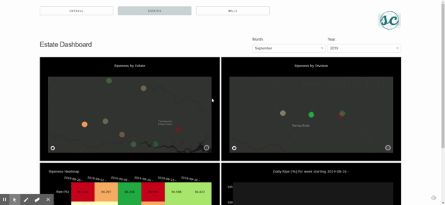

# Oil Manufacturing Tracker Dashboard

Demo of an interactive dashboard built with Python, Plotly and Dash. Features include cross-chart interactions on hover, URL routing and multipage app using Single Page App (SPA) design pattern, metric drillthrough, and custom KPI colors based on ranges of calculated values.

### Setup

Create a python3 virtual environment and run

```bash
$ pip install -r requirements.txt
```

### Run application

```bash
$ python index.py
```

The application is now running locally at http://127.0.0.1:8050/

Demo video link: https://youtu.be/kClhG_blQv0

### Features

##### Cross-chart hover interactions


---

##### URL routing and multipage app


---

##### Metric drillthrough page

